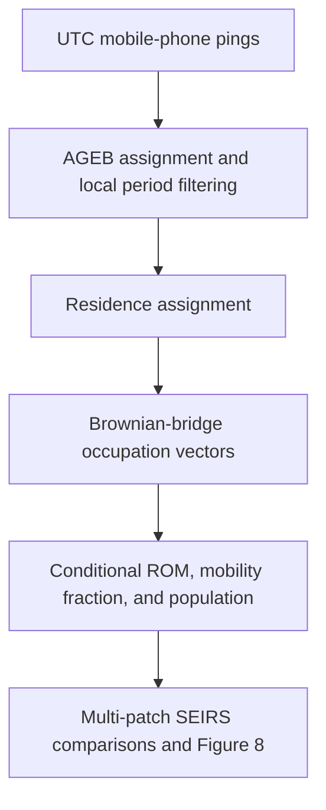

# Residence and occupation times in urban patches

Code accompanying:

> L. Leticia Ramírez-Ramírez, José A. Montoya, Jesús F. Espinoza, Chahak
> Mehta, Albert Orwa Akuno, and Tan Bui-Thanh (2025). “Use of mobile phone
> sensing data to estimate residence and occupation times in urban patches:
> human mobility restrictions and the 2020 COVID-19 outbreak in Hermosillo,
> Mexico.” *Computational Urban Science*, 5, article 10.
> [https://doi.org/10.1007/s43762-025-00168-y](https://doi.org/10.1007/s43762-025-00168-y)

The analysis assigns mobile-device observations to urban census areas
(AGEBs), infers a residence AGEB for each device, estimates occupation times
with Brownian bridges, constructs residence-occupation matrices (ROMs), and
uses those matrices in a multi-patch SEIRS model.

## Data availability

Raw mobile-phone observations and the SISVER case file are subject to
confidentiality restrictions and are not distributed here. The article states
that the mobility data were supplied by Lumex Consultores S.C. and may be
requested from the corresponding author. The public repository supports
software testing and synthetic simulations; empirical results require the
restricted inputs listed in the
[reproducibility notes](docs/REPRODUCIBILITY.md).

## Installation

Create the Conda environment:

```bash
conda env create -f environment.yml
conda activate time-residence
```

Run the test suite:

```bash
python -m unittest discover -s tests -v
# or
pytest
```

Run the synthetic example:

```bash
time-residence demo --output-dir outputs/demo
```

This command creates six synthetic model-input files, a six-panel figure,
period-level numerical results, and a JSON summary under `outputs/demo/`.

## Analysis workflow



The study uses the Hermosillo calendar windows reported in Table 2 of the
article:

| Code | Start date | End date | Comparison |
|---|---:|---:|---|
| P1A | 2020-09-21 | 2020-10-04 | P1, first part |
| P1B | 2020-10-26 | 2020-11-08 | P1, second part |
| P2A | 2020-09-21 | 2020-10-04 | P2, first part |
| P2B | 2020-11-02 | 2020-11-15 | P2, second part |
| P3A | 2020-09-21 | 2020-10-11 | P3, first part |
| P3B | 2020-10-12 | 2020-11-01 | P3, second part |

Source timestamps are interpreted as UTC and converted to
`America/Hermosillo` before filtering. Both endpoint dates are included, and
nighttime is the half-open local interval 22:00–06:00.

## Repository layout

| Path | Contents |
|---|---|
| `src/time_residence/` | Importable implementation and command-line interface |
| `research/scripts/` | Analysis and simulation scripts used for the article |
| `research/notebooks/` | Org-mode analyses and the duplicate-timestamp HTML report |
| `research/environment/` | Python 3.6 Pipenv snapshots from the analysis environment |
| `tests/` | Unit, algebraic-equivalence, and synthetic end-to-end tests |
| `docs/` | Mathematical methods, data contracts, and reproducibility information |
| `data/` | Local inputs and intermediate data; ignored by Git |
| `outputs/` | Generated figures and numerical results; ignored by Git |

The package under `src/time_residence/` provides the supported command-line
workflow. The files under `research/` document study-specific analyses and
experiments.

## Data preparation

The examples below use repository-relative paths. Complete input schemas are
given in the [data contract](docs/DATA_CONTRACT.md).

Create a stable AGEB index:

```bash
time-residence prepare-agebs \
  --agebs data/geometry/26a.shp \
  --output data/processed/agebs.csv
```

The geometry must declare a coordinate reference system and contain unique
AGEB codes and population counts. The default columns are `CVE_AGEB` and
`POBTOT`.

Assign pings to AGEBs:

```bash
time-residence assign-agebs \
  --pings data/private/pings.csv \
  --agebs data/geometry/26a.shp \
  --output data/processed/pings_with_ageb.csv
```

The command validates latitude and longitude ranges. If a source table is
confirmed to have reversed coordinate headers, add
`--repair-swapped-coordinates` as described in the data contract.

Select a period-part:

```bash
time-residence select-period \
  --pings data/processed/pings_with_ageb.csv \
  --period P1A \
  --eligible-ids data/private/P1A_eligible_ids.csv \
  --output data/processed/P1A/pings.csv
```

The eligibility table represents the minimum-ping criterion used in the
article. If `--eligible-ids` is omitted, every device observed in the period is
included.

Assign residence AGEBs:

```bash
time-residence assign-residences \
  --pings data/processed/P1A/pings.csv \
  --ageb-metadata data/processed/agebs.csv \
  --output data/processed/P1A/residences.csv \
  --seed 2025
```

Residence candidates are the modal AGEBs in the complete and nighttime
records. Population-weighted ties use a device-specific random seed, making
the assignment independent of record order and worker scheduling.

## Residence-occupation estimation

Estimate one occupation vector per device:

```bash
time-residence estimate-individual-roms \
  --pings data/processed/P1A/pings.csv \
  --agebs data/geometry/26a.shp \
  --output data/processed/P1A/individual_roms.json \
  --parameter-output data/processed/P1A/motion_parameters.json \
  --samples 1000 \
  --seed 2025
```

The default projected coordinate system is UTM zone 12N (`EPSG:32612`), in
accordance with the article. Use `--projected-crs EPSG:3857` to match the
projection in the study scripts. The default location-error standard deviation
is 28.85 m; `--estimate-location-error` selects joint estimation of the
Brownian and location-error parameters.

Build the epidemic-model input:

```bash
time-residence build-model-input \
  --period P1A \
  --individual-roms data/processed/P1A/individual_roms.json \
  --pings data/processed/P1A/pings.csv \
  --residences data/processed/P1A/residences.csv \
  --ageb-metadata data/processed/agebs.csv \
  --output data/model_inputs/P1A.npz
```

For each residence AGEB, this step calculates the fraction of sampled
residents observed outside their home AGEB. The corresponding ROM row is the
mean occupation vector among those residents. AGEB identifiers, ROM entries,
mobility fractions, and census populations are stored in the same NPZ file.

## Figure 8 simulation

Convert the matrix and CSV inputs used by the Figure 8 script:

```bash
time-residence import-article-inputs \
  --matrix-dir data/private/working_avg_res_mat \
  --alpha-dir data/private/one_alpha_POBTOT \
  --output-dir data/model_inputs
```

Run the six period-part simulations:

```bash
time-residence figure8 \
  --input-dir data/model_inputs \
  --output-dir outputs/figure8 \
  --seed-agebs 2956 3367 5734 6200
```

The default grid contains 100 equally spaced points from day 0 through day
200. The day-30 statistic is evaluated at the nearest grid point, day 30.303.
The command writes:

- `figure8.png`;
- `figure8_P1.npz`, `figure8_P2.npz`, and `figure8_P3.npz`, containing the
  complete time series and AGEB identifiers; and
- `figure8_summary.json`, containing the common-AGEB counts and day-30
  negative fractions.

Model equations, parameters, and numerical conventions are documented in the
[mathematical methods](docs/METHODS.md).

## Citation and license

Citation metadata are available in [CITATION.cff](CITATION.cff). The
associated archive is
[https://doi.org/10.5281/zenodo.11390633](https://doi.org/10.5281/zenodo.11390633).

The software is released under the [MIT License](LICENSE). The article is
distributed separately under the Creative Commons Attribution 4.0
International License.
