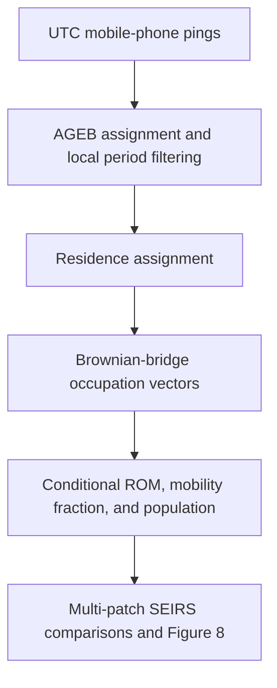

# Residence and occupation times in urban patches

This repository contains the code associated with:

> L. Leticia Ramírez-Ramírez, José A. Montoya, Jesús F. Espinoza, Chahak
> Mehta, Albert Orwa Akuno, and Tan Bui-Thanh (2025). “Use of mobile phone
> sensing data to estimate residence and occupation times in urban patches:
> human mobility restrictions and the 2020 COVID-19 outbreak in Hermosillo,
> Mexico.” *Computational Urban Science*, 5, article 10.
> [https://doi.org/10.1007/s43762-025-00168-y](https://doi.org/10.1007/s43762-025-00168-y)

The analysis assigns mobile-device observations to urban census areas
(AGEBs), infers a residence patch for each sampled device, estimates
individual occupation times with Brownian bridges, aggregates those estimates
into residence-occupation matrices (ROMs), and uses the matrices in a
multi-patch SEIRS model.

Raw mobile-phone observations and the SISVER case file are not distributed in
this repository. The article states that the mobility data were supplied by
Lumex Consultores S.C. under confidentiality conditions and may be requested
from the corresponding author. The synthetic demonstration below checks the
installation and the complete epidemic-simulation path; it does not reproduce
the numerical findings of the article.

## Quick start

Create the Conda environment and install the package:

```bash
conda env create -f environment.yml
conda activate time-residence
```

Run the deterministic synthetic demonstration:

```bash
time-residence demo --output-dir outputs/demo
```

The command writes six synthetic model-input files, a six-panel figure,
complete numerical differences for each period, and a JSON summary under
`outputs/demo/`. It requires no protected data.

Run the tests with either command:

```bash
python -m unittest discover -s tests -v
pytest
```

## Analysis structure



The six period-parts are the local Hermosillo calendar windows reported in
Table 2 of the article. Both endpoint dates are included.

| Code | Start date | End date | Comparison |
|---|---:|---:|---|
| P1A | 2020-09-21 | 2020-10-04 | P1, first part |
| P1B | 2020-10-26 | 2020-11-08 | P1, second part |
| P2A | 2020-09-21 | 2020-10-04 | P2, first part |
| P2B | 2020-11-02 | 2020-11-15 | P2, second part |
| P3A | 2020-09-21 | 2020-10-11 | P3, first part |
| P3B | 2020-10-12 | 2020-11-01 | P3, second part |

Source timestamps are interpreted as UTC and converted to
`America/Hermosillo` before period and nighttime filters are applied.
Nighttime is the half-open local interval 22:00–06:00.

## Repository layout

| Path | Contents |
|---|---|
| `src/time_residence/` | Tested, importable implementation and command-line interface |
| `research/scripts/` | Complete set of research scripts associated with the article |
| `research/notebooks/` | Org-mode analyses and the duplicate-timestamp HTML export |
| `research/environment/` | Original Pipenv specification and lock file |
| `tests/` | Unit, algebraic-equivalence, and synthetic end-to-end tests |
| `docs/` | Methods, file contracts, and implementation notes |
| `data/` | Local inputs and intermediate data; ignored by Git |
| `outputs/` | Generated figures and numerical results; ignored by Git |

All scripts contributed to the article are kept together under
`research/scripts/`, including `epidemic_simulation_code.py`. They are not
separated by contributor or delivery date. The package under `src/` provides
one portable interface around the shared computational workflow, with explicit
validation and reproducible random-number handling.

## Data preparation

The command examples use repository-relative paths. Other locations can be
passed directly; no source edit is required.

Create the stable AGEB ordering used by every matrix and vector:

```bash
time-residence prepare-agebs \
  --agebs data/geometry/26a.shp \
  --output data/processed/agebs.csv
```

The geometry must declare its coordinate reference system and contain unique
AGEB codes and population counts. The defaults are `CVE_AGEB` and `POBTOT`.

Assign each ping to an AGEB:

```bash
time-residence assign-agebs \
  --pings data/private/pings.csv \
  --agebs data/geometry/26a.shp \
  --output data/processed/pings_with_ageb.csv
```

The first repository version wrote correct coordinate values under interchanged
`lat` and `lon` headers. The command detects the Hermosillo signature and stops
instead of guessing. After checking the source file, pass
`--repair-swapped-coordinates` to repair that known inversion explicitly.

Select one period-part. An eligible-ID table can be supplied when reproducing
the article's minimum-ping filter:

```bash
time-residence select-period \
  --pings data/processed/pings_with_ageb.csv \
  --period P1A \
  --eligible-ids data/private/P1A_eligible_ids.csv \
  --output data/processed/P1A/pings.csv
```

Without `--eligible-ids`, all devices observed in the period are retained. The
repository does not infer the unpublished eligibility lists because the raw
records needed to verify them are confidential.

Infer residence AGEBs:

```bash
time-residence assign-residences \
  --pings data/processed/P1A/pings.csv \
  --ageb-metadata data/processed/agebs.csv \
  --output data/processed/P1A/residences.csv \
  --seed 2025
```

Residence candidates are modal AGEBs in the full and nighttime records. Ties
are sampled in proportion to census population with a device-specific seed, so
the result is independent of input row order and worker scheduling.

## Residence-occupation estimation

Estimate one normalized occupation vector per device:

```bash
time-residence estimate-individual-roms \
  --pings data/processed/P1A/pings.csv \
  --agebs data/geometry/26a.shp \
  --output data/processed/P1A/individual_roms.json \
  --parameter-output data/processed/P1A/motion_parameters.json \
  --samples 1000 \
  --seed 2025
```

The default projected coordinate system is UTM zone 12N (`EPSG:32612`), as
stated in the article. The research scripts used Web Mercator (`EPSG:3857`);
pass `--projected-crs EPSG:3857` when comparison with those calculations is the
priority. The default location-error standard deviation is 28.85 m, the value
in the research code. Use `--estimate-location-error` to estimate it jointly
with the Brownian-motion parameter under Equation (9) of the article.

Build the aligned epidemic-model input:

```bash
time-residence build-model-input \
  --period P1A \
  --individual-roms data/processed/P1A/individual_roms.json \
  --pings data/processed/P1A/pings.csv \
  --residences data/processed/P1A/residences.csv \
  --ageb-metadata data/processed/agebs.csv \
  --output data/model_inputs/P1A.npz
```

This stage computes, for each residence AGEB, the fraction of sampled residents
with at least one valid observation outside the home AGEB. The ROM row is the
mean occupation vector among those residents who leave. AGEB identifiers,
matrix rows and columns, mobility fractions, and census populations are stored
together in one validated NPZ file to prevent positional misalignment.

## Figure 8 simulation

If the `.npy` matrices and `alphas_*.csv` files used by the article's figure
script are available, convert them to the aligned model-input format:

```bash
time-residence import-article-inputs \
  --matrix-dir data/private/working_avg_res_mat \
  --alpha-dir data/private/one_alpha_POBTOT \
  --output-dir data/model_inputs
```

Then reproduce the six comparisons:

```bash
time-residence figure8 \
  --input-dir data/model_inputs \
  --output-dir outputs/figure8 \
  --seed-agebs 2956 3367 5734 6200
```

Defaults match the calculation associated with Figure 8: 100 equally spaced
times from day 0 through day 200; exposed and infected counts of one in each
seed AGEB; and the homogeneous SEIRS rates documented in
[`docs/METHODS.md`](docs/METHODS.md). The fraction of AGEBs with a negative
part-A-minus-part-B difference is evaluated at the available time nearest day
30, which is day 30.303 for this grid.

The command produces:

- `figure8.png`, with independent axes for all six panels;
- `figure8_P1.npz`, `figure8_P2.npz`, and `figure8_P3.npz`, containing the full
  time series and common AGEB identifiers; and
- `figure8_summary.json`, containing common-AGEB counts and day-30 negative
  fractions.

## Reproducibility boundaries

The mathematical and computational checks that can be completed without the
protected data are automated. They cover local-date selection, coordinate
repair, deterministic residence assignment, Brownian covariance and parameter
units, ROM conditioning and row stochasticity, matrix/vector alignment, the
SEIRS force-of-infection algebra, day-30 evaluation, and an end-to-end synthetic
run.

The numerical ROMs and published Figure 8 cannot be independently regenerated
from this checkout alone because the raw pings, eligibility lists, census
geometry, derived matrix/alpha inputs, and SISVER record used to select the
initial patches are not present. See
[`docs/REPRODUCIBILITY.md`](docs/REPRODUCIBILITY.md) for the exact distinctions
between statements in the article, the research scripts, and the tested
implementation.

## Citation and archive

Citation metadata are provided in [`CITATION.cff`](CITATION.cff). The associated
archived release is available at
[https://doi.org/10.5281/zenodo.11390633](https://doi.org/10.5281/zenodo.11390633).

## License

The software in this repository is released under the
[MIT License](LICENSE). The published article is separately distributed under
the Creative Commons Attribution 4.0 International License by its publisher.
